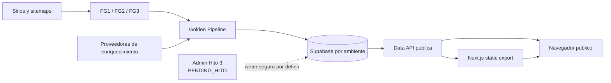

# Mapa Canonico De Arquitectura

Estas vistas describen la arquitectura verificable de StudIAMatch. Son
derivadas y no mantienen alcance, estado de tareas ni adopcion remota. La
autoridad contractual vive en [REQ-EST-001](../backlog_tareas/req_est_001_sprint_1/_index.md),
el estado en [Estado del proyecto](../estado_del_proyecto.md) y cada TASK, y la
adopcion DB en la [Matriz DB](../operaciones/matriz_adopcion_db.md).

## Estados De Lectura

| Etiqueta | Significado |
|---|---|
| `ACTUAL` | Comportamiento versionado u observado que la fuente enlazada permite afirmar. |
| `PENDING_HITO` | Alcance aprobado por adenda pero pendiente de TASK/subfase activa, candidate y evidencia. |
| `EXCLUDED` | Superficie fuera de Sprint 1 o fuera del paquete descrito. |

Git no demuestra aplicacion remota. Una nota `ACTUAL` sobre codigo tampoco
certifica Free, Pro o produccion.

## Vista General

## Vistas

1. [Contexto del sistema](./01_contexto_sistema.md): actores, sistemas externos y fronteras.
2. [Contenedores y componentes](./02_contenedores_componentes.md): frontend, workflows, pipeline y datos.
3. [Pipeline y estados](./03_pipeline_estados.md): estaciones, gates y estados persistentes.
4. [Datos y seguridad](./04_datos_seguridad.md): roles, RLS, clasificacion y limites.
5. [Despliegue y ambientes](./05_despliegue_ambientes.md): flujo local, Free, certificacion y Pro.
6. [Impacto y escalabilidad](./06_impacto_escalabilidad.md): impacto por Hito y limites conocidos.

## Reglas De Cambio

- Una vista se actualiza cuando cambia codigo, un ADR aceptado o evidencia
  remota canonica.
- Una vista pendiente nunca autoriza implementacion o promocion.
- Ningun hallazgo arquitectonico crea alcance. Se clasifica mediante el
  [gobierno de hallazgos](../pruebas/06_gobierno_hallazgos.md).
- No se publican credenciales, endpoints, project refs, PII, filas, payloads ni
  detalles explotables.
