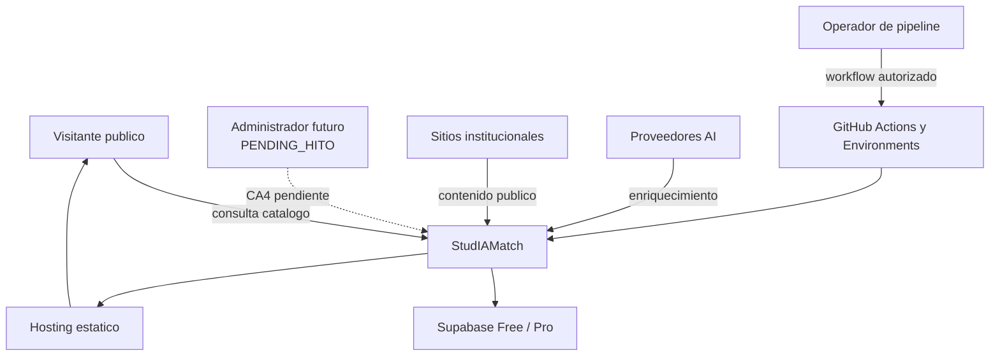

# Contexto Del Sistema

Vista derivada del sistema y sus dependencias. Ver [Mapa](./00_mapa.md).

## Actores Y Fronteras

| Actor o sistema | Interaccion autorizada | Limite |
|---|---|---|
| Visitante publico | Lee catalogo publicado y usa comparacion local | Sin escrituras privilegiadas ni PII automatizada |
| Operador de pipeline | Dispara o supervisa workflows por environment | Secrets solo en CI/backend |
| Administrador futuro | CA4 propone curacion manual | No existe identidad ni writer aprobado actualmente |
| Sitios institucionales | Fuentes publicas para discovery y harvesting | Allowlist, exclusiones, timeouts y circuit breaker |
| Proveedores AI | Enriquecimiento con fallback marcado | No demuestran verdad editorial ni busqueda semantica |
| Supabase | Persistencia y Data API por ambiente | Datos operativos no se copian Free a Pro |
| Hosting estatico | Publica `web/out` | No es backend administrativo |

## Alcance Temporal

- `ACTUAL`: frontend publico estatico, Golden Pipeline de cuatro estaciones,
  FG1/FG2/FG3 y Supabase por ambiente.
- `PENDING_HITO`: contrato CA2/CA3, `/admin`, Home y Resultados revisados; CA1-only
  esta aprobado pero pendiente de candidate y evidencia.
- `EXCLUDED`: email/webhook real-time de leads, embeddings, reviews reales,
  scraping automatico de logos y tipo de cambio real.
