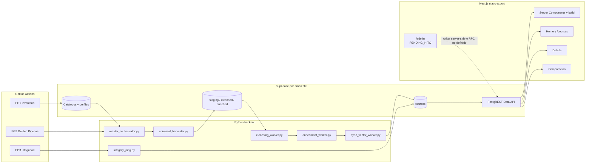

# Contenedores Y Componentes

Vista derivada de [Frontend](../estructura_frontend.md),
[Pipeline](../arquitectura_pipeline.md) y codigo versionado.

## Rutas Frontend Actuales

| Ruta | Contenedor | Estado |
|---|---|---|
| `/` | Home, busqueda y listado | `ACTUAL` |
| `/courses/` | Reutiliza la experiencia de Home | `ACTUAL` |
| `/courses/{institution}/{slug}/` | Detalle estatico con carga cliente | `ACTUAL` |
| `/compare/` | Comparacion de hasta tres programas | `ACTUAL` |
| `/privacidad/`, `/terminos/` | Contenido legal | `ACTUAL` |
| `/admin/` | Panel CA4 | `PENDING_HITO` |

No existe una ruta separada `/resultados/` en el baseline. Hito 5 define la
vista contractual de Resultados sin decidir por esta nota una ruta nueva.

## Responsabilidades

- Workflows: scheduling, guards de rama, environments, concurrencia y timeout.
- Python backend: discovery, ETL, persistencia, auditoria e integridad.
- Supabase: schema, RLS, RPC, catalogos y datos operativos por ambiente.
- Frontend: export estatico y lecturas publicas permitidas.
- Browser: filtros, navegacion y comparacion local; nunca secret keys.
