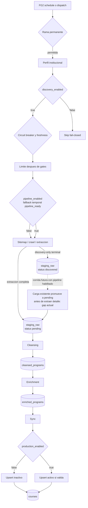

# Pipeline Y Estados

Esta vista describe el Golden Pipeline actual. No acredita ejecucion remota ni
adopcion DB. Ver [Arquitectura del pipeline](../arquitectura_pipeline.md).

## Estados Persistentes

| Estacion | Camino principal | Salidas laterales |
|---|---|---|
| `staging_raw` | `discovered -> pending -> processed` | `discarded`, `skipped` |
| `cleansed_programs` | `pending -> enriched` | `skipped` |
| `enriched_programs` | `pending -> synced` | `skipped`, `error` |
| `courses` | Upsert por URL | Activo o inactivo segun gates y validacion |

## Gates

1. Guard de rama y environment antes de secrets.
2. `discovery_enabled` antes del harvesting.
3. Circuit breaker y freshness antes del limite.
4. `allowed_url_patterns` y `exclusion_patterns` durante discovery.
5. `pipeline_enabled` en las estaciones; fallback temporal documentado.
6. Validaciones de ruido y persistencia parcial.
7. `production_enabled` antes de publicar activo.
8. Timeouts y errores propagados por el orquestador; fallos internos absorbidos
   por harvester/FG3 son un limite actual que CA1 debe detectar y cerrar.

FG2 y FG3 comparten concurrencia por ref con `cancel-in-progress=false`. FG3
tiene cron posterior, pero no una dependencia `needs` de FG2.

Discovery-only termina su corrida en filas `discovered`; cleansing consume
`pending` y no promueve automaticamente ese estado. En una corrida futura con
pipeline habilitado, el harvester actual carga esas URLs y puede promoverlas a
`pending` antes de extraer detalle, porque tambien las considera existentes.
Ese gap puede entregar filas sin contenido a cleansing y requiere el test de
reactivacion CA1. Las salidas `skipped` de estaciones posteriores aplican solo
a filas pendientes que cada worker inspecciona.

## Propuesto Por Hito

- CA1 exige evidencia efectiva de schedules, gates, circuit breakers y
  credenciales por ambiente.
- CA2 define contrato editorial y de calidad como unidad integral.
- CA3 exige conservar incompletos, marcar pendientes y no detener el lote.

Estas obligaciones permanecen `PLANNED` donde la TASK correspondiente no tenga
candidate y evidencia verificable.
