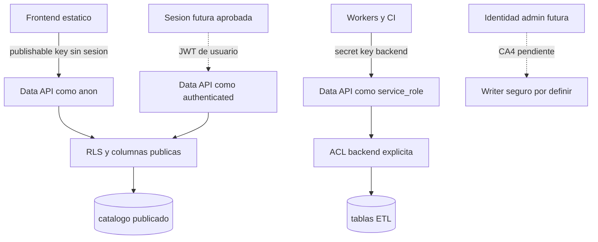

# Datos Y Seguridad

Vista publicable y sanitizada. La adopcion se decide unicamente en la
[Matriz DB](../operaciones/matriz_adopcion_db.md).

## Clasificacion De Datos

| Clase | Ejemplos | Regla |
|---|---|---|
| Catalogo versionado | instituciones, categorias, perfiles y reglas | DB-as-Code, promocion forward-only |
| Operativo por ambiente | cuatro estaciones del pipeline | Nunca copiar Free a Pro |
| Publico | campos permitidos de cursos publicados/verificados | Publishable key, RLS y allowlist |
| Data plane privilegiado | escrituras ETL autorizadas | Backend/CI con secret gestionada |
| Control plane | migrations y operaciones de release | Transport aprobado o executor privado; nunca la secret de Data API por si sola |
| Privado o sensible | PII, secrets, artifacts privados y terminos comerciales | Nunca en Git ni evidencia publica |

## Contrato De Identidades

- Data API usa API keys solo en `apikey`; no se reutilizan como Bearer.
- Publishable key: browser y lecturas publicas permitidas.
- Secret key: backend/CI; nunca bundle del navegador.
- `authenticated` no equivale a administrador.
- La identidad administrativa CA4 y su writer siguen `PENDING_HITO`.
- La identidad canary y su transport se fijan en el candidate/runbook aprobado;
  esta vista no infiere que una key Data API pueda seleccionar un rol arbitrario.
- Roles, grants, RLS, owner, modo de seguridad y `search_path` se verifican por
  comportamiento semantico, no por conteos nominales.

El acceso publico y backend anterior resume contratos `[GIT/DERIVED]`; no
acredita una postcondicion remota actual. Sesion/admin y cualquier binding
canary futuro permanecen pendientes hasta candidate y evidencia propios.

## Estado Y Fuente

| Marca | Afirmacion permitida |
|---|---|
| `[GIT]` | Existe fuente versionada; no prueba aplicacion. |
| `[REMOTE]` | Hubo observacion documentada; no prueba que siga vigente hoy. |
| `[DERIVED]` | Comparacion entre ledger, fuente y postcondicion. |
| WIP local | No es candidate, estado remoto ni capacidad autorizada. |

Leads/email no son una estacion del Golden Pipeline. Su arquitectura integral
permanece diferida y no se incorpora por inferencia a ningun CA.
