# Despliegue Y Ambientes

El flujo es manual, secuencial y fail-closed. Ver
[Flujo de release](../operaciones/flujo_release_minimo.md).

```mermaid
flowchart LR
    Local["Local y PostgreSQL efimero"]
    Feature["feat/*"]
    Development["desarrollo"]
    LocalCandidate["F9.8 candidate local CA1-only"]
    Certification["certificacion"]
    CertificationCanary["F9.9 canary y QA"]
    UAT["USER_PERSONAL_UAT"]
    Readiness["F9.10 readiness F10"]
    Main["main"]
    Production["Production"]
    PreMain["Canary Production"]
    Schedules["Schedules graduales"]
    Observe["Observacion productiva"]

    Local -->|tests y auditorias| Feature
    Feature -->|PR, CI y review| Development
    Development --> LocalCandidate
    LocalCandidate -->|candidate selectivo| Certification
    Certification --> CertificationCanary --> UAT --> Readiness
    Readiness -->|PR humano| Main
    Main --> Production --> PreMain --> Schedules --> Observe
```

## Estado Vigente

| Nodo | Estado documentable |
|---|---|
| F9.7 | `COMPLETED_BY_CONTRACT_REBASELINE` |
| F9.8 | `COMPLETED_VERIFIED_POST_MERGE`; candidate local CA1-only replay-validado |
| F9.9 | `COMPLETED_QA_VERIFIED`; Certification conserva desviacion fail-closed aceptada |
| F9.10 | `ACTIVE_AUTHORIZED_IN_PROGRESS`; controles main/canary/rollback en validacion local |
| Supabase Free/Pro | `UNCHANGED_NOT_ATTESTED`; sin certificacion nueva |
| Backfill | Trasladado a Hito 2; prohibido en Hito 1 CA1-only |
| Validaciones tecnicas Certification | PR #282 y CI post-merge registrados; candidate F9.10 final aun debe pasar PRs SDLC y revalidacion |
| `USER_PERSONAL_UAT` | Pendiente; debe ligarse a SHA/tree final de Certification antes de readiness F10 |
| Readiness F10 | No alcanzado |
| Production | Bloqueado |
| Hitos 2 a 5 | `PENDING`, sin subfase ejecutable |

## Stop Conditions

- Secretos, PII o identificadores sensibles en archivos, logs o diffs.
- Candidate, ancestry, tree, manifest o checksums no verificables.
- Drift RLS/ACL, writers activos o postcondicion no demostrada.
- Backfill, schema/RLS o datos operativos incluidos en el candidate CA1-only.
- Test, Context Graph, canary, smoke o revision humana faltante.

La rama `certificacion` y Supabase Free son conceptos distintos. Para Hito 1
CA1-only, Certification es la rama/release de canary y QA; Supabase Free/Pro no
cambian por este rebaseline.
