# Despliegue Y Ambientes

El flujo es manual, secuencial y fail-closed. Ver
[Flujo de release](../operaciones/flujo_release_minimo.md).

```mermaid
flowchart LR
    Local["Local y PostgreSQL efimero"]
    Feature["feat/*"]
    Development["desarrollo"]
    LocalCandidate["F9.8 candidate local CA1-only"]
    Certification["certificacion"]
    CertificationCanary["F9.9 canary y QA"]
    UAT["USER_PERSONAL_UAT"]
    Readiness["F9.10 readiness F10"]
    ControlPlane["F10.6 control-plane"]
    F107["F10.7 entrega tecnica post-main"]
    Main["main"]
    Production["Production"]
    PreMain["Canary Production"]
    Schedules["Schedules graduales"]
    Observe["Observacion productiva"]

    Local -->|tests y auditorias| Feature
    Feature -->|PR, CI y review| Development
    Development --> LocalCandidate
    LocalCandidate -->|candidate selectivo| Certification
    Certification --> CertificationCanary --> UAT --> Readiness --> ControlPlane
    ControlPlane -->|PR #291 y boundary post-merge| F107
    F107 -->|main tecnico| Main
    Main --> Production --> PreMain --> Schedules --> Observe
```

## Estado Vigente

| Nodo | Estado documentable |
|---|---|
| F9.7 | `COMPLETED_BY_CONTRACT_REBASELINE` |
| F9.8 | `COMPLETED_VERIFIED_POST_MERGE`; candidate local CA1-only replay-validado |
| F9.9 | `COMPLETED_QA_VERIFIED`; Certification conserva desviacion fail-closed aceptada |
| F9.10 | `COMPLETED_READINESS_F10`; PR #285 mergeado en `certificacion@5cd27c6f6c35808865b7084673a83f9f690d3760`, boundary 32 objetos digest `34f3789d597bf4012378d6e509a03ee6e9ef37edaee95713023421538cab1aa5`; superseded como autoridad F10.7 por [ADR-0008](../decisiones/ADR-0008_rebaseline_f10_7_gate_reconstruction.md) |
| F10.6 | `COMPLETED_CONTROL_PLANE`; environments programados fail-closed, branch policy `main`, reviewer humano, secrets minimos por nombre y runs legacy schedule cancelados con cero pasos |
| F10.7 | `COMPLETED_TECHNICAL_DELIVERY`; PR #291 mergeado en `main@64e4ed895d43121c5683e26a355993f18e528a5c`, boundary 32 objetos digest `8fafc74e415d6875315e8584eb17705e24c40777675996cde9bf4ff0ccf7ddff`, Security Audit PASS, Cloudflare Pages `SUCCESS`, DB Sync cancelado cero-pasos |
| Supabase Free/Pro | `UNCHANGED_NOT_ATTESTED`; sin certificacion nueva |
| Backfill | Trasladado a Hito 2; prohibido en Hito 1 CA1-only |
| Validaciones tecnicas Certification | PR #282/#285 y CI post-merge registrados; candidate final `certificacion@5cd27c6f6c35808865b7084673a83f9f690d3760` / tree `419b25f69e4eef4d7277a7439ca45efc1eaac242` |
| `USER_PERSONAL_UAT` | `PASS` registrado para SHA/tree final de Certification; promocion tecnica posterior a `main` registrada sin cerrar runtime |
| Readiness F10 | F10.6 completada; F10.7 entrega tecnica registrada; F10.8-F10.9 siguen bloqueadas |
| Production | `PENDING_CANARY_AND_OBSERVATION`; Cloudflare Pages publico el arbol de `main` pero no sustituye canary Production |
| Hitos 2 a 5 | `PENDING`, sin subfase ejecutable |

## Stop Conditions

- Secretos, PII o identificadores sensibles en archivos, logs o diffs.
- Candidate, ancestry, tree, manifest o checksums no verificables.
- Drift RLS/ACL, writers activos o postcondicion no demostrada.
- Backfill, schema/RLS o datos operativos incluidos en el candidate CA1-only.
- Test, Context Graph, canary, smoke o revision humana faltante.
- Deployment Cloudflare Pages de `main` no observado, no documentado o usado como sustituto de canary Production.
- Gate `f10-main-boundary` ausente de la promocion o boundary F10.7 no verificable.

La rama `certificacion` y Supabase Free son conceptos distintos. Para Hito 1
CA1-only, Certification es la rama/release de canary y QA; Supabase Free/Pro no
cambian por este rebaseline.
