# Despliegue Y Ambientes

El flujo es manual, secuencial y fail-closed. Ver
[Flujo de release](../operaciones/flujo_release_minimo.md).

```mermaid
flowchart LR
    Local["Local y PostgreSQL efimero"]
    Feature["feat/*"]
    Development["desarrollo"]
    Free["Supabase Free"]
    FreeSchema["free_schema_certified"]
    FreeBackfill["free_backfill_certified"]
    FreeValidation["Validaciones tecnicas Free\nACL, FG2 smoke, canary, cleanup y QA"]
    UAT["USER_PERSONAL_UAT"]
    FreeCertified["free_certified"]
    Certification["certificacion"]
    Pro["Supabase Pro"]
    Main["main"]
    PreMain["Canary y smoke Pro"]
    Observe["Observacion productiva"]

    Local -->|tests y auditorias| Feature
    Feature -->|PR, CI y review| Development
    Development -. "gate remoto separado" .-> Free
    Free --> FreeSchema --> FreeBackfill --> FreeValidation --> UAT --> FreeCertified
    FreeCertified -->|PR humano| Certification
    Certification -. "workflow manual aprobado" .-> Pro
    Pro --> PreMain -->|aprobacion humana| Main --> Observe
```

## Estado Vigente

| Nodo | Estado documentable |
|---|---|
| Candidate local F9.7 | Certificaciones locales historicas disponibles |
| Supabase Free | Para este corte F9.7: `UNCHANGED_NOT_ATTESTED`; no certificado |
| Backfill | No autorizado |
| Validaciones tecnicas Free | No ejecutadas; obligatorias antes de UAT |
| `USER_PERSONAL_UAT` | Hold futuro de F9.10 |
| `free_certified` | No alcanzado |
| Supabase Pro | Bloqueado |
| Hitos 2 a 5 | `PENDING`, sin subfase ejecutable |

## Stop Conditions

- Secretos, PII o identificadores sensibles en archivos, logs o diffs.
- Candidate, ancestry, tree, manifest o checksums no verificables.
- Drift RLS/ACL, writers activos o postcondicion no demostrada.
- Backfill mezclado con schema/RLS o datos operativos copiados entre ambientes.
- Test, Context Graph, canary, smoke o revision humana faltante.

La rama `certificacion` y Supabase Free son conceptos distintos: la primera es
una rama/release; el segundo es el ambiente DB de desarrollo y certificacion.
