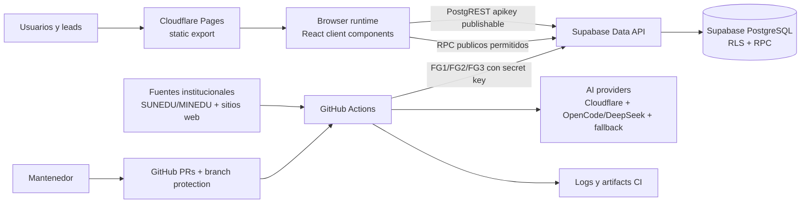
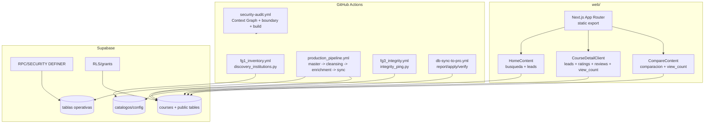

# Arquitectura Pipeline

> Fuente canonica de arquitectura aplicativa, pipeline, runtime e infraestructura. No crea alcance ni autoriza ejecucion; los gates viven en [Estado Del Proyecto](estado_del_proyecto.md) y en los work packages vigentes.

Snapshot de investigacion: `desarrollo@96c6e7e97a1a6c703eb3b5a3a22f6f6d21aa28e9`.
Reconciliacion post-PR425: arquitectura publicada en `desarrollo@4cce43a743de5860c4da86eecf1782efab91d26b`, tree `ac16b545b74a03b149aac538062def20101187fb`.
Reconciliacion post-PR426: GOV-HOM publicado en `desarrollo@fddb9cea6ac44a1f7f7b31e93a7b2f2cc0eeacd1`, tree `5e7d087ac45457264ea29dfc1aa7373efd909290`; GOV-CI prepara la separacion entre `security-audit` y branch protection review.
Reconciliacion post-PR427: GOV-CI publicado en `desarrollo@b878c5764e55cb2646b60c4777e363489fe48e8b`, tree `174c18efd840fff6ce27fce9fe1dc4edcd65abe8`; PR #428 fallo O2 por `Canonical Path Boundary` y requiere GOV-CI2 antes de nuevo O2.
Reconciliacion post-PR429: GOV-CI2 publicado en `desarrollo@1ac74f78fec6290e214444e9d2f18619ae3fd3b6`, tree `8191790192580f2e9fb1ddb48d85ab28714720f9`; PR #428 permanece bloqueado y requiere GOV-CI3 para eliminar bootstrap autorreferencial de grants antes de un nuevo O2.
Reconciliacion post-PR430: GOV-CI3 publicado en `desarrollo@235c2329eb5fd8903c31785640a63466b23f0dd8`, tree `cc774746d21cb6649f7018da3049fc811a3f294b`; PR #431 fallo antes de runner porque `Promotion Boundary` usaba Environment `Certification` y el ref `refs/pull/431/merge` no cumple su branch policy. GOV-CI4 cambia el gate a Environment `Promotion` dedicado.
Reconciliacion post-PR433: O2 completo en `certificacion@3682d0af8c16ed0476663e6727b14f03ec14ed78`, tree `acabd0965d4aa716904917caab691b3867aa5798`; el push post-merge `32615044699` fallo `Canonical Path Boundary` por evaluar el delta de promocion como WP incremental. GOV-CI5 agrega validacion estructural post-merge antes de O3.
Reconciliacion post-PR435: GOV-CI5 publicado en `desarrollo@9f265e41eb4724727e5bd4b1a5cf6ef5c75a4845`, tree `fc9ff315d20648e87d049d5fb244a09ea214bfb8`; PR #435 fallo O2 antes de merge por F9.7 legacy automatico. GOV-CI6 retira F9.7 de triggers automaticos y exige promociones target-aware `promote/gov-hom-006-oN`.
Reconciliacion post-PR437: GOV-CI6 publicado en `desarrollo@26a44af87e4e610d905763b6a5b8c14b64607954`, tree `3b956049f3535263b2fdbe3177dc7118005b7af1`; PR #437 fue mergeado a `certificacion` pero fallo post-merge run `32650341464` por checks con `pull_requests: []` y `merged_by=romelhc95-approver`. GOV-CI7 implementa evidencia post-merge fail-closed y reemplaza HOM-006 por HOM-007.
Reconciliacion post-PR438: GOV-CI7 publicado en `desarrollo@16045d45811cbe12299ce2ba66f6afd75a93d1ee`, tree `29f76f029f9c1c664fd8a9fc2ebda30d75a0a4df`; el push post-merge run `32655520324` fallo porque un PR ordinario a `desarrollo` fue clasificado como promocion invalida. GOV-CI8 separa `NOT_APPLICABLE`, `BLOCKED` y `VERIFIED_PROMOTION`, y reemplaza HOM-007 por HOM-008.
Reconciliacion post-PR440: GOV-CI8 publicado en `desarrollo@1bc36ae6a4381c5ceac5e30c3970c39099965bc3`, tree `7df05c52da47855d62c082f7cfbd12ee1e38b965`; PR #440 completo O2 a `certificacion@df2cde3626c75fa4733bf1624fb105d8ee08c076` pero el push post-merge run `32662084712` fallo por `POST_MERGE_MERGER_INVALID`. GOV-CI9 define owner-only branch updates para evitar que `romelhc95-approver` revise y mergee la misma promocion.
Reconciliacion post-PR441: GOV-CI9 publicado en `desarrollo@17d383291a5f2877074b54b66f2a0ff48a643667`, tree `e0029083e24016b97fc8896be3be2d4285414117`; el push post-merge run `32666126533` fallo con `POST_MERGE_ATTESTATION_DUPLICATE` por parser de attestations no section-aware. GOV-CI10 corrige parsing estricto por seccion y reemplaza HOM-009 por HOM-010.

## Principios Vigentes

- StudIAMatch publica un frontend Next.js con `output: 'export'` en Cloudflare Pages.
- El frontend no usa `@supabase/supabase-js`; usa PostgREST con `fetch` y publishable key en `apikey`.
- El pipeline de datos corre en GitHub Actions con tres flujos principales: FG1 inventario, FG2 ETL, FG3 integridad.
- Supabase/PostgreSQL es el plano de datos y expone PostgREST/RPC/RLS.
- Las escrituras privilegiadas usan `NEXT_SUPABASE_SECRET_KEY` solo en CI/backend autorizado.
- Los datos operativos no se promueven Free -> Pro como flujo normal; cada ambiente produce sus propias filas operativas.
- `security-audit` usa boundary incremental para PR normales y boundary estructural para promociones O2-O5 entre ramas protegidas; GOV-CI2 no autoriza deploys, writers ni DB.
- Las solicitudes versionadas en `.context/r3_grants/` son `REQUESTED_JIT_SINGLE_USE` con bindings simbolicos; no son approvals R3 ni contienen SHA/tree autorreferenciales.
- `Promotion Boundary` para O2-O5 usa el Environment `Promotion`; no usa `Certification`, `Production` ni `Development` para evitar branch policies incompatibles con refs sinteticos de PR.
- Los pushes post-merge se clasifican como `VERIFIED_PROMOTION`, `NOT_APPLICABLE` o `BLOCKED`; solo un PR ordinario unico a `desarrollo` puede ser `NOT_APPLICABLE` y usar boundary incremental. Falta de evidencia, evidencia ambigua, identidad invalida o ruta superior no promocional falla cerrado.
- Las promociones GOV-CI10 son target-aware: el candidate merge commit usa como primer padre el target SHA exacto, segundo padre el source SHA exacto, y `tree(candidate)=tree(source)=T_FINAL`. El workflow F9.7 queda `MANUAL_FROZEN_ONLY` sin triggers `pull_request`/`push`.
- Desired state GOV-CI9: `romelhc95-approver` revisa/aprueba, pero no actualiza `desarrollo`, `certificacion` ni `main`; un ruleset permanente `owner-only-protected-branch-updates` con `Restrict updates` y bypass exclusivo para `romelhc95` debe aplicarse mediante R3 JIT separado antes del siguiente O2.
- GOV-CI10: PR ordinarios usan solo `## Governance Attestation`; promociones O2-O5 usan solo `## Promotion Attestation`; no hay fallback al body completo y solo HOM-010 exacto puede ser `VERIFIED_PROMOTION`.

## Diagrama De Contexto

## Contenedores

## Runtime Frontend

- Configuracion: `web/next.config.js` usa static export, trailing slash e imagenes sin optimizacion.
- Stack: `web/package.json` declara Next 16, React 19, TypeScript, Tailwind y scripts `dev`, `build`, `lint`.
- Build: `npm run build` limpia `.next` y `out`, luego genera el artefacto estatico.
- Rutas principales: `/`, `/courses`, `/courses/[institution]/[slug]`, `/compare`, `/privacidad`, `/terminos`.
- Variables publicas: `NEXT_PUBLIC_SUPABASE_URL` y `NEXT_PUBLIC_SUPABASE_PUBLISHABLE_KEY`.
- Header de API: `apikey` con publishable key; no se usa `Authorization: Bearer` para Data API.
- Lecturas publicas: `courses`, `institutions`, `categories`, `ratings`, `reviews` y queries relacionadas.
- Escrituras publicas previstas: `leads`, `ratings`, `reviews`, y RPC `increment_view_count` cuando RLS/grants lo permitan.
- Ruta dinamica de curso: `generateStaticParams()` intenta prerender desde Supabase y usa fallback seguro si faltan variables o datos.

## Pipeline FG1-FG3

```mermaid
flowchart LR
    FG1[FG1 Inventario\ndiscovery_institutions.py] --> Institutions[(institutions)]
    Institutions --> Profiles[(institution_site_profiles)]
    Institutions --> FG2H[FG2 Harvest\nmaster_orchestrator.py + universal_harvester.py]
    Profiles --> FG2H
    FG2H --> Staging[(staging_raw)]
    Staging --> Clean[FG2 Cleansing\ncleansing_worker.py]
    Clean --> Cleansed[(cleansed_programs)]
    Cleansed --> Enrich[FG2 Enrichment\nenrichment_worker.py]
    Enrich --> Enriched[(enriched_programs)]
    Enriched --> Sync[FG2 Sync\nsync_vector_worker.py]
    Sync --> Courses[(courses)]
    Courses --> FG3[FG3 Integrity\nintegrity_ping.py]
    FG3 --> Courses
```

## Writers Autorizados

| Estacion | Script | Lee | Escribe | Guardas |
|---|---|---|---|---|
| FG1 | `scripts/core/discovery_institutions.py` | `config/institution_sources.json`, `institutions` | `institutions` | `--source-slug`, `--no-insert`, canary redaction |
| FG2 harvest | `scripts/core/master_orchestrator.py`, `universal_harvester.py` | `institutions`, `institution_site_profiles`, `staging_raw` | `staging_raw`, telemetry en `institutions`, perfil si falta | `pipeline_enabled`/`pipeline_ready`, `discovery_enabled`, circuit breaker, exclusiones |
| FG2 cleansing | `scripts/core/cleansing_worker.py` | `staging_raw`, `institution_site_profiles`, `institutions` | `cleansed_programs`, status en `staging_raw` | locks RPC, noise patterns, exclusiones regex |
| FG2 enrichment | `scripts/core/enrichment_worker.py` | `cleansed_programs`, `institution_site_profiles` | `enriched_programs`, status en `cleansed_programs` | `pipeline_enabled`/`pipeline_ready`, provider fallback |
| FG2 sync | `scripts/core/sync_vector_worker.py` | `enriched_programs`, `courses`, `institution_site_profiles` | `courses`, status en `enriched_programs` | noise validation, `production_enabled`, no mock overwrite publico |
| FG3 | `scripts/core/integrity_ping.py` | `courses`, `institutions` | `courses` | HTTPS/public IP validation, grace 404 |

## Workflows Y Ambientes

| Workflow | Trigger | Ambiente | Efecto |
|---|---|---|---|
| `security-audit.yml` | PR/push a `desarrollo`, `certificacion`, `main` | N/A | credential scan, links, Context Graph, manifests, boundary, lint, typecheck, build |
| `fg1_inventory.yml` | schedule mensual `0 0 1 * *`, manual | `Development`, `Certification`, `Production`, `Production-Scheduled-FG1` | inventario institucional; ejecucion requiere gate vigente |
| `production_pipeline.yml` | schedule diario `0 5 * * *`, manual | `Development`, `Certification`, `Production`, `Production-Scheduled-FG2` | FG2 ETL completo hasta sync y boundary audit; ejecucion requiere gate vigente |
| `fg3_integrity.yml` | schedule diario `0 11 * * *`, manual | `Development`, `Certification`, `Production`, `Production-Scheduled-FG3` | integridad y desactivacion por 404; ejecucion requiere gate vigente |
| `db-sync-to-pro.yml` | push a `main`, manual | `Production` | report/apply/verify de DB-as-code bajo gates R3/JIT |
| `production_canary.yml` | manual en `main` | `Production` | canary acotado con writers pausados |
| `f9_9_certification_canary.yml` | manual en `certificacion` | `Certification` | canary de certificacion acotado |
| `f9-7-contract.yml` | PR con paths sensibles | N/A | contrato PostgreSQL 17 y secretos |
| `opencode.yml` | comentarios `/oc` | GitHub | integra OpenCode |

`security-audit.yml` incluye un Governance Preflight R2 aplicable solo a `pull_request` cuyo destino sea `desarrollo`. Ese job valida `Base-SHA`, `Candidate-SHA`, `WP-Digest`, manifest, el `head.sha` real del PR, ancestry, paths y co-change; no consulta reviews ni se dispara por `pull_request_review`. Para `certificacion`, `main` y `push`, el preflight debe quedar skipped y cualquier promocion superior requiere R3/JIT separado. GitHub branch protection es la unica autoridad mecanica de review humana, por lo que no se necesita rerun manual cuando llega la review.

El despliegue automatico de Cloudflare Pages asociado a ramas/PR de `desarrollo` se clasifica como `AUTOMATIC_NON_PRODUCTION_PREVIEW_SIDE_EFFECT` cuando no modifica dominio productivo, environment Production, secrets, triggers manuales ni writers. No sustituye canary, no autoriza produccion y no es evidencia de aceptacion productiva. Si apunta a Production, dispara/reintenta manualmente, cambia configuracion/secrets o ejecuta writers/egress, la promocion debe detenerse y requerir R3 JIT explicito.

## Controles De Produccion

- `.github/scripts/production_control_preflight.sh` centraliza writers permitidos.
- En `main`, schedules productivos existen en YAML pero solo pueden ejecutarse cuando el gate aplicable habilita `AUTOMATION_ENABLED=true` y `PRODUCTION_WRITERS_PAUSED=false`.
- `DB-SYNC` requiere dispatch manual y writers pausados.
- `PRODUCTION-CANARY` requiere dispatch manual, `AUTOMATION_ENABLED=false` y writers pausados.
- Schedules fuera de `main` se bloquean; la disponibilidad tecnica de dispatch manual en `desarrollo`/`certificacion` no autoriza ejecucion sin gate vigente.

## Desarrollo Local

- Desarrollo se ejecuta dentro del contenedor `studiamatch-dev` definido en `docker-compose.yml`.
- El contenedor usa `node:20-bookworm`, Python 3, Playwright y dependencias del sistema.
- El repositorio se monta en `/app` y el frontend expone `3000:3000`.
- Las pruebas de gobierno H2 usan `docker-compose.h2-test.yml` con red deshabilitada y variables cloud vacias.

## Secretos Por Nombre

- Supabase URL: `SUPABASE_URL`, `NEXT_PUBLIC_SUPABASE_URL`.
- Publishable keys: `NEXT_SUPABASE_PUBLISHABLE_KEY`, `NEXT_PUBLIC_SUPABASE_PUBLISHABLE_KEY`.
- Secret key CI/backend: `NEXT_SUPABASE_SECRET_KEY`.
- AI: `CF_API_TOKEN`, `CF_ACCOUNT_ID`, `OPENCODE_API_KEY`.
- Canary variables: prefijos `F9_9_` y `F10_` documentados en workflows.

## Documentos Legacy

Los documentos bajo `docs/architecture/` y `docs/orquestador-sdlc/` son evidencia historica o explicaciones parciales salvo que enlacen explicitamente a esta nota. Las contradicciones conocidas se registran como `SUPERSEDED_HISTORY` en sus encabezados.

## Mecanismo De Actualizacion

- Cualquier cambio en frontend, pipeline, workflows, Supabase o ambientes debe actualizar esta nota si altera runtime, writer, flujo de datos, gates o secretos por nombre.
- Los cambios de schema/RLS/RPC deben sincronizarse con [Sistema DB Supabase](sistema_db_supabase.md) y [Matriz Adopcion DB](operaciones/matriz_adopcion_db.md).
- La validacion semantica debe fallar si esta nota o sus pares canonicos desaparecen.
