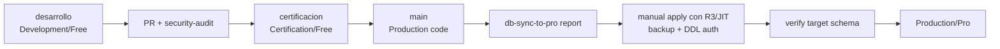

# Matriz Adopcion DB

> Fuente canonica para documentar adopcion de schema/configuracion por ambiente. No autoriza migraciones, DDL/DML ni operaciones remotas.

Snapshot de investigacion: `desarrollo@96c6e7e97a1a6c703eb3b5a3a22f6f6d21aa28e9`.
Snapshot GOV-CI: `desarrollo@fddb9cea6ac44a1f7f7b31e93a7b2f2cc0eeacd1`, tree `5e7d087ac45457264ea29dfc1aa7373efd909290`.
Snapshot GOV-CI2: `desarrollo@b878c5764e55cb2646b60c4777e363489fe48e8b`, tree `174c18efd840fff6ce27fce9fe1dc4edcd65abe8`; sin cambios DB.
Snapshot GOV-CI3: `desarrollo@1ac74f78fec6290e214444e9d2f18619ae3fd3b6`, tree `8191790192580f2e9fb1ddb48d85ab28714720f9`; sin cambios DB.
Snapshot GOV-CI4: `desarrollo@235c2329eb5fd8903c31785640a63466b23f0dd8`, tree `cc774746d21cb6649f7018da3049fc811a3f294b`; sin cambios DB.
Snapshot GOV-CI5: `desarrollo@32dc50c2a26f0d8cf34c5a39a4f10a821bf821aa`, tree `acabd0965d4aa716904917caab691b3867aa5798`; sin cambios DB.
Snapshot GOV-CI6: `desarrollo@9f265e41eb4724727e5bd4b1a5cf6ef5c75a4845`, tree `fc9ff315d20648e87d049d5fb244a09ea214bfb8`; sin cambios DB.
Snapshot GOV-CI7: `desarrollo@26a44af87e4e610d905763b6a5b8c14b64607954`, tree `3b956049f3535263b2fdbe3177dc7118005b7af1`; sin cambios DB.
Snapshot GOV-CI8: `desarrollo@16045d45811cbe12299ce2ba66f6afd75a93d1ee`, tree `29f76f029f9c1c664fd8a9fc2ebda30d75a0a4df`; sin cambios DB.

## Ambientes

| Rama | GitHub Environment | Supabase | Uso | Writers |
|---|---|---|---|---|
| `desarrollo` | `Development` | Free | desarrollo y validacion inicial | Manual/CI segun gates |
| `certificacion` | `Certification` | Free | QA, canary y auditoria | Manual/CI segun gates |
| `main` | `Production` | Pro | produccion | Solo gates productivos |
| `main` schedule | `Production-Scheduled-FG1/FG2/FG3` | Pro | automatizacion programada | Requiere `AUTOMATION_ENABLED=true` y writers no pausados |

## Estado De Adopcion Documental

| Dominio | Development | Certification | Production | Evidencia Local |
|---|---|---|---|---|
| Restore schema base | Esperado por repo | Esperado por repo | Esperado por repo | `db/restore_full_schema.sql` |
| Migraciones versionadas | Esperadas por rama | Promovidas por PR | Aplicadas por DB sync autorizado | `db/migrations/*.sql`, `db-sync-to-pro.yml` |
| Catalogos/config | Promotable | Promotable | Promotable | migraciones y `check_db_parity.py` |
| Operativas FG2 | Locales al ambiente | Locales al ambiente | Locales al ambiente | `staging_raw`, `cleansed_programs`, `enriched_programs`, `courses` |
| RLS/RPC/grants | Deben validarse por migracion | Deben validarse por QA | Requieren R3/JIT para cambios | migrations F100-F116 y F10.8 |
| Frontend public contract | Publishable key | Publishable key | Publishable key | `web/src/lib/supabase.ts` |

## Promocion DB-As-Code

## Reglas De Adopcion

- Schema, RLS, RPC, grants y catalogos/configuracion viajan como migraciones versionadas.
- Tablas operativas no se sincronizan entre ambientes como flujo normal.
- Backfill, sync Free/Pro, restore, DDL/DML remoto y RLS/grants remotos requieren autorizacion R3/JIT separada.
- La paridad DB no debe fallar por conteos distintos en tablas operativas.
- La paridad si debe fallar por drift de schema/configuracion promotable.
- GOV-CI2 solo cambia controles de promocion en CI; no cambia schema, migraciones, ambientes, writers, RLS, grants ni adoption state.
- GOV-CI3 solo corrige bootstrap de solicitudes R3 versionadas para promociones; no cambia schema, migraciones, ambientes, writers, RLS, grants ni adoption state.
- GOV-CI4 solo corrige el Environment de `Promotion Boundary` para promociones O2-O5; no cambia schema, migraciones, ambientes Supabase, writers, RLS, grants ni adoption state.
- GOV-CI5 solo corrige la validacion CI post-merge de promociones; no cambia schema, migraciones, ambientes Supabase, writers, RLS, grants ni adoption state.
- GOV-CI6 solo corrige promociones target-aware y retira F9.7 automatico; no cambia schema, migraciones, ambientes Supabase, writers, RLS, grants ni adoption state. O3 posterior debe reportar `NO_DB_CHANGES` en DB Sync detect-only; apply queda prohibido sin R3 separado.
- GOV-CI7 solo corrige evidencia post-merge fail-closed y solicitudes HOM-007; no cambia schema, migraciones, ambientes Supabase, writers, RLS, grants ni adoption state. O3 posterior debe reportar `NO_DB_CHANGES` en DB Sync detect-only; apply queda prohibido sin R3 separado.
- GOV-CI8 solo corrige clasificacion post-merge fail-closed y solicitudes HOM-008; no cambia schema, migraciones, ambientes Supabase, writers, RLS, grants ni adoption state. O3 posterior debe reportar `NO_DB_CHANGES` en DB Sync detect-only; apply queda prohibido sin R3 separado.

## Writers Por Ambiente

| Writer | Development | Certification | Production | Gate |
|---|---|---|---|---|
| FG1 inventario | Disponible solo con gate vigente | Disponible solo con gate vigente | Solo Production controls + gate vigente | `fg1_inventory.yml` |
| FG2 ETL | Disponible solo con gate vigente | Disponible solo con gate vigente | Solo Production controls + gate vigente | `production_pipeline.yml` |
| FG3 integridad | Disponible solo con gate vigente | Disponible solo con gate vigente | Solo Production controls + gate vigente | `fg3_integrity.yml` |
| DB sync Pro | No aplica | No aplica | Manual y acotado | `db-sync-to-pro.yml` |
| Production canary | No aplica | No aplica | Manual, writers pausados | `production_canary.yml` |
| Maintenance/backfill | Remediacion explicita | Remediacion explicita | R3/JIT separado | scripts maintenance |

## Evidencia Requerida Para Cambiar Estado

| Cambio | Evidencia minima |
|---|---|
| Nueva migracion | PR con `security-audit`, PostgreSQL gate, review humano y manifest/gate aplicable |
| Apply a Pro | Report pending, backup/PITR confirmado, `ddl_authorization_id`, apply manual, verify schema |
| Cambio RLS/RPC | Tests de contrato, policy/grant diff, evidencia de no exposicion anon indebida |
| Cambio writer | Arquitectura actualizada, matriz de escritor, gate de produccion, prueba de no secreto |
| Cambio workflow/gate CI | Arquitectura actualizada, matriz revisada, PR a `desarrollo`, attestation con `Base-SHA`/`Candidate-SHA`/digest validada por `security-audit`, y review humana validada exclusivamente por branch protection |
| Backfill/sync | Runbook JIT, ambiente origen/destino, mapeo UUID por slug/nombre, rollback |

## Drift Conocido

- No se consulto ledger remoto de Supabase en esta remediacion documental.
- `restore_full_schema.sql` debe complementarse con migraciones posteriores para describir el estado esperado.
- Documentos legacy anteriores a esta matriz pueden mencionar service-role names o schedules antiguos; quedan historicos.

## Mecanismo De Actualizacion

- Actualizar esta matriz en el mismo PR que cambie `db/migrations/**`, workflows DB, production controls o adoption evidence.
- Mantenerla sincronizada con [Sistema DB Supabase](../sistema_db_supabase.md) y [Arquitectura Pipeline](../arquitectura_pipeline.md).
- `security-audit` valida candidate/digest y co-change; la review humana no dispara CI, no requiere rerun manual y queda gobernada por branch protection. `certificacion` y `main` siguen requiriendo R3 JIT separado.
