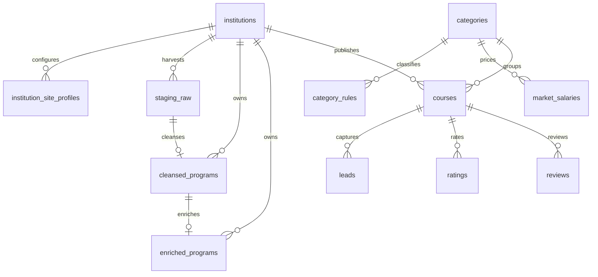
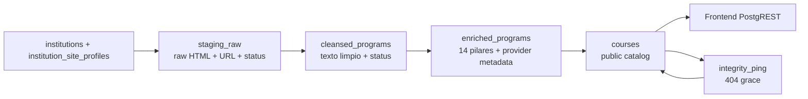

# Sistema DB Supabase

> Fuente canonica del modelo de datos, RLS, RPC, escritores y adopcion por ambiente. No autoriza DDL/DML ni operaciones remotas.

Snapshot de investigacion: `desarrollo@96c6e7e97a1a6c703eb3b5a3a22f6f6d21aa28e9`.
Snapshot GOV-CI10: `desarrollo@17d383291a5f2877074b54b66f2a0ff48a643667`, tree `e0029083e24016b97fc8896be3be2d4285414117`; sin cambios DB. PR #441 publico CI9 pero fallo post-merge con `POST_MERGE_ATTESTATION_DUPLICATE`; CI10 solo corrige gobierno CI y attestations. O3 posterior requiere R3 JIT explicito, reconoce Cloudflare Pages Production rebuild automatico y DB Sync detect-only con resultado obligatorio `NO_DB_CHANGES`.
Snapshot GOV-CI11: `desarrollo@cbdfe9dab373a2b427df4864b14427f3b2358789`, tree `99c1cda4f0091aaee35752caec69745051c41a3a`; sin cambios DB. CI11 solo corrige gobierno CI/promocion. O3 posterior requiere R3 JIT explicito, Cloudflare Pages app_id `85455` y `DB Sync Detect Only=NO_DB_CHANGES`; apply, DDL/DML y writers siguen prohibidos sin R3 separado.

## Modelo De Datos

## Clasificacion De Tablas

| Tipo | Tablas | Politica |
|---|---|---|
| Catalogos/configuracion | `institutions`, `institution_site_profiles`, `categories`, `category_rules`, `market_salaries` | Viajan como SQL versionado y deben mantenerse en paridad por slug/regla/configuracion. |
| Operativas pipeline | `staging_raw`, `cleansed_programs`, `enriched_programs`, `courses` | No se copian Free -> Pro por flujo normal; cada ambiente las produce ejecutando FG2. |
| Publicas/producto | `courses`, `leads`, `ratings`, `reviews`, `institutions`, `categories`, `market_salaries` | Expuestas por PostgREST segun RLS/grants. |
| Auditoria/soporte | `email_log`, `schema_repair_audit`, `supabase_migrations` si existe | Uso operativo o de migraciones; no son contrato frontend. |

## Lineage Operativo

## Tablas Principales

| Tabla | Rol | Claves/Campos Relevantes | Escritores |
|---|---|---|---|
| `institutions` | Semillas institucionales | `id`, `name`, `slug`, `website_url`, telemetria harvest | FG1, harvester telemetry |
| `institution_site_profiles` | Configuracion de crawling/gates | `institution_id`, `pipeline_ready`, `pipeline_enabled`, `production_enabled`, `discovery_enabled`, exclusiones, circuit breaker | seed/profile tools, harvester control |
| `staging_raw` | Bronze/raw | `institution_id`, `url`, `raw_html`, `content_hash`, `status` | `universal_harvester.py`, cleansing status |
| `cleansed_programs` | Silver/clean | `staging_id`, `institution_id`, `url`, clean fields, `status` | `cleansing_worker.py`, enrichment status |
| `enriched_programs` | Gold/pre-public | `cleansed_id`, 14 pilares, provider metadata, `status` | `enrichment_worker.py`, sync status |
| `courses` | Producto publico | `institution_id`, `category_id`, `url`, `slug`, precio, modalidad, fechas, ROI, `is_active`, `is_verified` | `sync_vector_worker.py`, `integrity_ping.py` |
| `leads` | Captura comercial | contacto, `course_id`, `lead_type`, campos de formulario | frontend publico si RLS permite |
| `ratings` | Rating social | `course_id`, `rating`, nickname, timestamp | frontend publico/autenticado segun RLS |
| `reviews` | Review social | `course_id`, contenido validado, timestamp | frontend publico/autenticado segun RLS |
| `categories` | Taxonomia | `id`, `name`, `description` | migraciones/catalogo |
| `category_rules` | Clasificacion | `category_id`, `keyword`, `priority` | migraciones/catalogo |
| `market_salaries` | ROI | salarios por categoria | migraciones/catalogo |

## RPC Y Funciones

| RPC/Funcion | Uso | Exposicion Esperada |
|---|---|---|
| `lock_staging_records` | Lock optimista de `staging_raw` | backend/service |
| `atomic_cleansing_promote` | Inserta `cleansed_programs` y marca staging procesado | `service_role` |
| `atomic_enrichment_promote` | Upsert provider-aware de `enriched_programs` | `service_role` |
| `increment_view_count` | Incremento desde frontend | publico si policy/grant lo permite |
| `fn_auto_assign_category` | Trigger de categoria | interno DB |
| `exec_sql` | Migracion/maintenance excepcional | restringido a `service_role`; no frontend |

## RLS Y Grants

- RLS esta habilitado para tablas publicas y ETL en el schema restaurado.
- La intencion vigente por migraciones endurecidas es que `courses` publico requiera `is_active=true`, `is_verified=true` y perfil `production_enabled=true`.
- `institution_site_profiles` solo expone minimamente `institution_id` y `production_enabled` cuando corresponde.
- Tablas ETL bloquean anon/authenticated y permiten escrituras solo con secret/service context.
- `leads`, `ratings` y `reviews` dependen de policies vigentes; si frontend escribe anon, el schema aplicado debe permitirlo explicitamente.
- RPCs privilegiadas revocan `PUBLIC`, `anon` y `authenticated` salvo excepcion documentada.

## Contrato De Credenciales

- Publishable keys comienzan con `sb_publishable_` y se usan para reads/frontend.
- Secret keys comienzan con `sb_secret_` y se usan solo en backend/CI autorizado.
- Supabase Data API usa header `apikey`; no reutiliza la key como `Authorization: Bearer`.
- Operaciones Free+Pro simultaneas deben exigir pares explicitos `FREE_*` y `PRO_*` y rechazar reutilizacion.
- Nunca documentar valores, project refs sensibles o tokens en este archivo.

## Adopcion Por Ambiente

La matriz vigente se mantiene en [Matriz Adopcion DB](operaciones/matriz_adopcion_db.md). Esta nota define el modelo esperado; la prueba final de adopcion requiere evidencias de migracion, CI y branch/environment.

## Fuentes De Schema

- `db/restore_full_schema.sql` es una base reconstruible, no necesariamente el estado terminal por si sola.
- El estado esperado debe interpretarse como restore schema mas `db/migrations/*.sql` en orden aplicable.
- Sin consultar el ledger remoto de Supabase no se afirma que todos los ambientes tengan todas las migraciones aplicadas.

## Drift Conocido

- Documentos legacy describian workers paralelos y writes directos a `courses`; el flujo vigente usa estaciones `staging_raw -> cleansed_programs -> enriched_programs -> courses`.
- Algunas policies de restore son mas amplias que las migraciones de hardening posteriores.
- La escritura frontend de ratings/reviews debe validarse contra RLS real antes de cambios funcionales.

## Mecanismo De Actualizacion

- Toda migracion, cambio RLS/RPC/grants o cambio de escritor debe actualizar esta nota.
- Cambios de flujo, workflow o runtime deben sincronizarse con [Arquitectura Pipeline](arquitectura_pipeline.md).
- Cambios por ambiente deben sincronizarse con [Matriz Adopcion DB](operaciones/matriz_adopcion_db.md).
