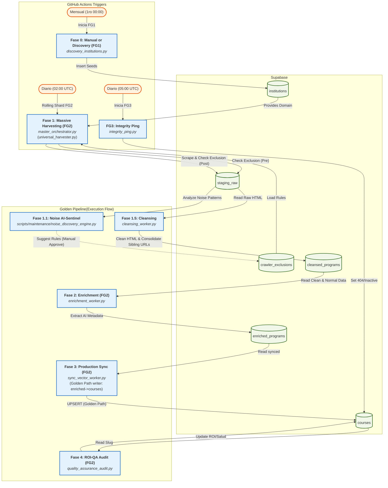

# Documento Detallado de Pipeline Workflow (Macro/Micro) y Diccionario de Datos - StudIAMatch

Este documento detalla el pipeline de automatización ejecutado en **GitHub Actions**, especificando los scripts involucrados y las tablas impactadas en cada etapa.

## Flujo Macro (Arquitectura de Automatización)



---

## Detalle Fino por Estación

### 1. Inventario y Descubrimiento (FG1)
*   **Script**: `scripts/core/discovery_institutions.py`
*   **Propósito**: Identificar o Registrar nuevas instituciones licenciadas y registrarlas como "semillas" para el harvester.
*   **Tablas Impactadas**:
    | Tabla | Acción | Descripción |
    | :--- | :--- | :--- |
    | `institutions` | `INSERT` | Agrega slugs de nuevas instituciones y URLs base. |

### 2. Massive Harvesting (FG2 - Fase 1)
*   **Script**: `scripts/core/master_orchestrator.py` (Llama a `universal_harvester.py`).
*   **Propósito**: Rastreo profundo de Sitemaps y URLs para extraer HTML crudo. Utiliza una estrategia de **Rolling Shards** (fragmentación diaria) para procesar un grupo de instituciones por día basadas en su última fecha de ejecución (`last_harvest_at`), evitando el límite de 6 horas de GitHub Actions.
*   **Tablas Impactadas**:
    | Tabla | Acción | Descripción |
    | :--- | :--- | :--- |
    | `staging_raw` | `INSERT / UPDATE` | Almacena el `raw_html`, `effective_url`, `canonical_url` y `content_hash`. |
    | `institutions` | `UPDATE` | Registra el timestamp (`last_harvest_at`) y la duración de la sesión. |

### 2.5. Saneamiento (FG2 - Fase 1.5)
*   **Script**: `scripts/core/cleansing_worker.py`.
*   **Propósito**: Limpieza de HTML crudo (eliminación de scripts, navs, footers) para reducir el consumo de tokens y normalización de metadatos JSON.
*   **Tablas Impactadas**:
    | Tabla | Acción | Descripción |
    | :--- | :--- | :--- |
    | `cleansed_programs` | `INSERT` | Almacena el texto limpio y normalizado listo para ser consumido por IA. |

### 3. LLM Enrichment (FG2 - Fase 2)
*   **Script**: `scripts/core/enrichment_worker.py`.
*   **Propósito**: Procesamiento con IA (Cascada CF/GH/Gemini) para extraer los 14 pilares de metadata.
*   **Tablas Impactadas**:
    | Tabla | Acción | Descripción |
    | :--- | :--- | :--- |
    | `cleansed_programs` | `SELECT` + `UPDATE` | Lee registros `pending`, aplica lock optimista, marca como `synced` al terminar. |
    | `enriched_programs` | `UPSERT` (vía RPC `atomic_enrichment_promote`) | Inserta o actualiza metadata de IA. ON CONFLICT por `cleansed_id`. |

### 4. Production Sync & Vectorization (FG2 - Fase 3)
*   **Script**: `scripts/core/sync_vector_worker.py`.
*   **Propósito**: Golden Path writer. Lee `enriched_programs` con `status='synced'`, valida `official_name` (rechaza `None`/`""`/`<3 chars`), serializa `curriculum_summary` con `json.dumps()`, y realiza UPSERT en `courses` con `is_verified=True`.
*   **Tablas Impactadas**:
    | Tabla | Acción | Descripción |
    | :--- | :--- | :--- |
    | `enriched_programs` | `SELECT` + `UPDATE` | Lee registros `synced`, marca como `synced` tras upsert exitoso. |
    | `courses` | `UPSERT` (por `url`) | Único escritor autorizado del Golden Path. Setea `is_verified=True`. |

### 5. ROI-QA Audit (FG2 - Fase 4)
*   **Script**: `scripts/maintenance/taxonomy_roi_audit.py`.
*   **Propósito**: Verificar coherencia entre salarios del mercado y categorías asignadas.
*   **Tablas Impactadas**:
    | Tabla | Acción | Descripción |
    | :--- | :--- | :--- |
    | `courses` | `UPDATE` | Corrige campos inconsistentes. |

### 6. Daily Integrity Ping (FG3)
*   **Script**: `scripts/core/integrity_ping.py`.
*   **Propósito**: Validar enlaces rotos y manejar el periodo de gracia.
*   **Tablas Impactadas**:
    | Tabla | Acción | Descripción |
    | :--- | :--- | :--- |
    | `courses` | `PATCH` | Cambia `is_active` a `false` si el 404 persiste por más de 3 días. |

---

## Caminos de Escritura a `courses` (Bypass Paths)

Históricamente existían 7 caminos de escritura a la tabla de producción. Post-Fase 52, solo quedan 2:

| # | Escritor | Tipo | Estado | Notas |
|---|----------|------|--------|-------|
| BP-7 | `sync_vector_worker.py` (Golden Path) | `UPSERT` | Activo | Único camino completo — pasa por las 4 estaciones. `is_verified=True`. |
| BP-M | `integrity_ping.py` | `PATCH` | Activo | Solo modifica `is_active` y `last_404_at`. |

**Paths eliminados** (Fases 52-53):
- BP-1: `enrichment_worker.py` escribía directo a `courses` — ahora escribe a `enriched_programs`
- BP-2: `sync_vector_worker.py` leía de `enriched_programs` como bypass — ahora es el único escritor
- BP-3: `llm_enrichment_worker.py` — movido a `scripts/deprecated/`
- BP-4: `harvest_processor.py` — movido a `scripts/deprecated/`
- BP-5: Harvesters dedicados (IDAT, UPC, PUCP, USIL, UTP, U. Lima) — escriben directo a `courses` con `is_verified=True`. By design para datos de alta calidad de fuentes confiables.

### Bypass utilitario: `batch_enrich_courses.py`
- **Script**: `scripts/maintenance/batch_enrich_courses.py`
- **Propósito**: Corregir datos puntuales sin pasar por las 4 estaciones.
- **Flujo**: Lee HTML de `staging_raw` → LLM → `courses` (PATCH directo).
- **Uso**: Solo para correcciones manuales, no en pipeline automático.

---

## Máquinas de Estado por Tabla

### `staging_raw`
```
discovered → pending → processing → processed
                            ↓         ↓
                          error    discarded
```
- `discovered`: URL encontrada por sitemap/BFS, HTML no extraído aún.
- `pending`: Listo para scraping (o re-procesamiento).
- `processing`: Lock optimista (RPC `lock_staging_records`).
- `processed`: Extracción exitosa.
- `error`: Fallo técnico (reintentable).
- `discarded`: Descartado permanentemente (ruido, obsolescencia).

### `cleansed_programs`
```
pending → processing → synced
             ↓
          discarded
```
- `sync` vector lee `synced`, marca como `synced` post-upsert.

### `enriched_programs`
```
pending → synced
  ↓
discarded
```
- `sync` vector lee `synced`, valida `official_name`, upsert en `courses`.

### `courses`
- `is_active` (boolean): toggle de visibilidad. FG3 desactiva tras 3 días de 404.
- `is_verified` (boolean): sello de calidad. `sync_vector_worker` y harvesters dedicados setean `True`.

---

## Guardas de Ejecución

| Guarda | Valor | Ubicación |
|--------|-------|-----------|
| **Time Guard** | 20400s (5h 40m) | `universal_harvester.py` — shutdown elegante 20 min antes del timeout de GitHub Actions (6h) |
| **Freshness Guard** | 3 días | `integrity_ping.py` — inactiva cursos tras 3 días consecutivos de 404 |
| **LLM Fallback** | Triple-cloud cascade | `enrichment_worker.py` — Cloudflare → GitHub Models → Gemini |
| **Rate Limiting** | 1.5s entre iteraciones | `enrichment_worker.py` |
| **Circuit Breaker** | 3 errores 403/429 consecutivos | `universal_harvester.py` — aborta scraping de la institución |
| **Content Hashing** | SHA256 del texto limpio | `universal_harvester.py` — solo re-procesa si el contenido cambió |
| **PDF/File Skip** | 28 extensiones no-HTML | `universal_harvester.py:_is_valid_crawl_url()` — evita descargar PDFs/XLSX con Playwright |

---

## Flujo Micro (Optimizaciones a Nivel de Código)

A diferencia del flujo macro que define la arquitectura de datos, el flujo micro detalla las optimizaciones internas que deben implementarse en los scripts para garantizar escalabilidad, rendimiento y cumplimiento de los principios de Arquitectura Hexagonal y TDD.

### 1. Inyección de Dependencias y Testabilidad (Arquitectura Hexagonal)
*   **Problema:** Los scripts instancian directamente conexiones a la BD (`get_db_client()`) y APIs de terceros.
*   **Solución:** Extraer la lógica pura a servicios de dominio. Refactorizar los constructores de los workers (ej. `__init__(self, db_client=None, llm_provider=None)`) para permitir inyección de dependencias (Mocks) en pruebas unitarias, buscando un >80% de cobertura.

### 2. Optimización de Red y Latencia (Bottlenecks)
*   **Problema N+1:** El harvester consulta PostgreSQL fila por fila para validar el `content_hash`. En local (baja latencia) es imperceptible, pero al conectarse a la API de Supabase vía red causará lentitud.
*   **Solución:** Implementar Caché en Memoria. Al inicio, descargar todos los hashes de la institución en un diccionario y validar en memoria (`O(1)`).

### 3. Bulk Upserts (Operaciones en Lote)
*   **Problema:** `db_client.py` hace UPSERT fila por fila.
*   **Solución:** Modificar la función `_upsert_api` en el cliente de base de datos para aceptar listas de diccionarios (`List[dict]`) y hacer envíos en lote a la API REST de Supabase, reduciendo la carga de E/S.

### 4. Estricto Cumplimiento de Contratos (JSON Schema)
*   **Problema:** La IA retorna Arrays ricos (ej. `categories`, `requirements`), pero el `sync_vector_worker.py` los aplana a texto o toma solo el primer elemento.
*   **Solución:** Extraer el prompt de la IA a un `course_schema_v1.json` (Contract-First API Design). Asegurar que la tabla `courses` y `enriched_programs` usen columnas `JSONB` o `TEXT[]` en PostgreSQL para preservar la riqueza de los datos generados por el LLM.

---

## 💎 Los 14 Pilares de Alta Fidelidad
Cada programa que alcanza la tabla `courses` ha sido enriquecido con los siguientes campos obligatorios extraídos por IA:

1.  **Nombre Oficial** (Sin encabezados basura).
2.  **Institución** (Mapeada al registro maestro).
3.  **Precio Estimado** (Normalizado a PEN).
4.  **Moneda**.
5.  **Duración** (En texto y meses).
6.  **Modalidad** (Presencial, Remoto o Híbrido).
7.  **Sede / Localidad** (Crítico para deduplicación).
8.  **Grado Académico** (Bachiller, Maestría, Curso, etc.).
9.  **Requisitos de Ingreso**.
10. **Malla Curricular** (Resumen estructurado en JSON).
11. **Fecha de Inicio** (Si está disponible).
12. **Categoría Taxonómica** (Tecnología, Negocios, etc.).
13. **Nivel de Dificultad** (Jr, Mid, Sr).
14. **Resumen de IA** (Descripción profesional de 2 frases).

---

## Diccionario de Datos Maestro (Esquema Completo y Funcionalidad)

Este diccionario detalla el 100% de los campos del modelo de base de datos, su utilidad técnica y el proceso (script) que los gestiona.

### 1. `institutions` (Semilla de Rastreo)
| Campo | Tipo | Proceso(s) | Utilidad / Funcionalidad |
| :--- | :--- | :--- | :--- |
| `id` | UUID | Todos (R) | Identificador único. FK principal para vincular cursos y leads. |
| `name` | TEXT | `harvester` (R) | Nombre oficial de la universidad; usado en logs y prompts de IA. |
| `slug` | TEXT | `orchestrator` (R) | Identificador amigable (ej. `up`) para organización de archivos. |
| `website_url` | TEXT | `harvester` (R) | URL de inicio para los algoritmos de Discovery (Sitemaps/BFS). |
| `location_lat/long`| NUMERIC| Backend (R) | Coordenadas para geolocalización en mapas del Frontend. |
| `address` | TEXT | Frontend (R) | Dirección física de la sede principal de la institución. |
| `last_harvest_at`| TZ | `harvester` (W) | Marca de tiempo de la última recolección exitosa. |
| `last_harvest_duration_sec`| INT | `harvester` (W) | Tiempo total (segundos) que tomó procesar la institución. |
| `created_at/updated_at`| TZ | Auditoría | Trazabilidad de creación y cambios en el registro maestro. |

### 2. `staging_raw` (Estación 1: Bronce / Datos Crudos)
| Campo | Tipo | Proceso(s) | Utilidad / Funcionalidad |
| :--- | :--- | :--- | :--- |
| `id` | UUID | `harvester` (W) | ID del registro de captura cruda. |
| `institution_id` | UUID | `harvester` (W) | Vínculo con la universidad dueña de la URL. |
| `url` | TEXT | `harvester` (RW) | URL única. Posee un índice UNIQUE para evitar duplicar capturas. |
| `raw_name` | TEXT | `harvester` (W) | Título de la página extraído sin procesamiento (SEO Title). |
| `raw_description` | TEXT | `harvester` (W) | Meta-description de la web para análisis rápido. |
    | `raw_html` | TEXT | `harvester` (W) | Código fuente HTML completo (limitado a 500KB) para extracción. |
| `raw_json_ld` | JSONB | `harvester` (W) | Datos estructurados Schema.org encontrados en el código. |
    | `raw_og_tags` | JSONB | `harvester` (W) | Etiquetas OpenGraph (Social Media) de la URL. |
    | `html_content`| TEXT | `harvester` (W) | Contenido HTML adicional o alternativo extraído. |
    | `description_long`| TEXT | `harvester` (W) | Descripción larga extraída del body de la página. |
    | `status` | TEXT | Todos (RW) | Estado del flujo: `discovered`, `pending`, `processing`, `processed`, `error`, `discarded`. |
| `discard_reason` | TEXT | `cleanser` (W) | Motivo por el cual la página fue ignorada (ej: es una noticia). |
| `processing_error` | TEXT | `cleanser` (W) | Log de errores técnicos durante el intento de limpieza. |
| `effective_url` | TEXT | `harvester` (W) | URL final tras todas las redirecciones automáticas. |
| `canonical_url` | TEXT | `harvester` (W) | URL canónica oficial definida en el tag HTML. |
| `content_hash` | TEXT | `harvester` (RW) | Hash SHA256 para detectar si la web cambió (Delta Scraping). |
| `last_harvested_at`| TZ | `harvester` (W) | Fecha del último contacto exitoso con el servidor de origen. |
| `metadata` | JSONB | Todos (W) | Contenedor flexible para logs de red y telemetría. |

### 3. `cleansed_programs` (Estación 1.5: Plata / Saneamiento)
| Campo | Tipo | Proceso(s) | Utilidad / Funcionalidad |
| :--- | :--- | :--- | :--- |
| `id` | UUID | `cleanser` (W) | ID único del programa saneado. |
| `staging_id` | UUID | `cleanser` (W) | Vínculo con la data cruda original (Lineage). |
| `institution_id` | UUID | `cleanser` (W) | Relación con la institución para heredar reputación. |
| `url` | TEXT | `cleanser` (W) | URL normalizada (puede incluir `#sede` para desambiguación). |
| `clean_name` | TEXT | `cleanser` (W) | Nombre del curso sin ruido publicitario ni "clickbait". |
| `clean_description`| TEXT | `cleanser` (W) | Texto depurado (sin tags HTML) listo para el prompt de IA. |
| `modality` | TEXT | `cleanser` (W) | Clasificación rápida: Presencial, Remoto o Híbrido. |
| `location` | TEXT | `cleanser` (W) | Campus o sede detectada en la página. |
| `base_price` | NUMERIC| `cleanser` (W) | Monto numérico detectado mediante Regex monetario. |
| `currency` | TEXT | `cleanser` (W) | Símbolo de moneda detectado (PEN, USD). |
| `effective_url` | TEXT | `cleanser` (W) | URL final capturada; parte de la clave única compuesta. |
| `canonical_url` | TEXT | `cleanser` (W) | Identidad SEO del curso; prioridad para la de-duplicación. |
    | `status` | TEXT | `enricher` (R) | Estado para la siguiente fase: `pending`, `processing`, `synced`, `discarded`. |
    | `metadata` | JSONB | `cleanser` (W) | Parámetros técnicos del proceso de limpieza. |

### 6. `crawler_exclusions` (Escudo Anti-Ruido)
| Campo | Tipo | Proceso(s) | Utilidad / Funcionalidad |
| :--- | :--- | :--- | :--- |
| `id` | UUID | Sistema | ID único de la regla de exclusión. |
| `institution_id` | UUID | `harvester` (R) | Institución a la que aplica (NULL = regla global para todas). |
| `pattern` | TEXT | `harvester` (R) | Substring o patrón de URL a bloquear (ej: `/noticias/`, `.pdf`). |
| `reason` | TEXT | Admin | Justificación de la exclusión (ej: "Página de blog, no curso"). |
| `is_active` | BOOL | `harvester` (R) | Toggle para habilitar/deshabilitar sin borrar la regla. |
| `created_at` | TZ | Auditoría | Fecha de creación de la regla. |

### 7. `enriched_programs` (Estación 2: Oro / Inteligencia IA) (antes sección 4)
| Campo | Tipo | Proceso(s) | Utilidad / Funcionalidad |
| :--- | :--- | :--- | :--- |
| `id` | UUID | `enricher` (W) | ID del registro enriquecido por LLM. |
| `cleansed_id` | UUID | `enricher` (W) | Relación con la data limpia. |
| `official_name` | TEXT | `enricher` (W) | Nombre académico formal validado por la IA. |
| `duration_text` | TEXT | `enricher` (W) | Duración literal (ej: "2 años y medio"). |
| `duration_months` | INT | `enricher` (W) | Duración normalizada en meses para filtros de búsqueda. |
| `total_cost_est` | NUMERIC| `enricher` (W) | Inversión total estimada calculada por la IA. |
| `requirements` | TEXT | `enricher` (W) | Requisitos de ingreso extraídos y estructurados. |
| `graduate_profile` | TEXT | `enricher` (W) | Perfil del egresado y competencias adquiridas. |
| `curriculum_summary`| JSONB | `enricher` (W) | Malla curricular estructurada en formato objeto. |
| `modality` | TEXT | `enricher` (W) | Modalidad refinada por IA (corrigiendo la fase anterior). |
| `primary_campus` | TEXT | `enricher` (W) | Campus principal detectado por el modelo. |
| `degree_type` | TEXT | `enricher` (W) | Tipo de grado (Maestría, Bachiller, Curso, etc.). |
| `categories` | TEXT | `enricher` (W) | Sugerencia taxonómica generada por la IA. |
| `ai_summary` | TEXT | `enricher` (W) | Descripción profesional corta (2 frases) para la UI. |
| `embedding` | TEXT | `enricher` (W) | Representación vectorial temporal del curso. |
| `status` | TEXT | `sync` (RW) | Estado de sincronización: `pending`, `synced`. |
| `difficulty_level` | TEXT | `enricher` (W) | Nivel objetivo: Básico, Intermedio o Avanzado. |

### 8. `courses` (Producción Final / Experiencia de Usuario)
| Campo | Tipo | Proceso(s) | Utilidad / Funcionalidad |
| :--- | :--- | :--- | :--- |
| `id` | UUID | `sync` (W) | ID final del producto en el catálogo público. |
| `institution_id` | UUID | `sync` (W) | FK a la tabla maestra de universidades. |
| `name` | TEXT | `sync` (W) | Nombre comercial final para visualización. |
| `slug` | TEXT | `sync` (W) | URL amigable y única (SEO). |
| `price_pen` | NUMERIC| `sync` (W) | Precio normalizado a Soles para el buscador. |
| `price_status` | TEXT | `sync` (W) | `publicado` o `consultar` (si no hay precio claro). |
| `mode` | TEXT | `sync` (W) | Modalidad final mostrada al usuario. |
    | `duration` | TEXT | `sync` (W) | Tiempo de estudio final. |
    | `seniority_level` | TEXT | `sync` (W) | Experiencia previa requerida (Jr, Mid, Sr). |
    | `roi_months` | NUMERIC | `enricher` (W) | Meses para recuperar la inversión del curso. |
    | `last_scraped_at` | TZ | `sync` (W) | Fecha de la última actualización desde la web. |
    | `last_404_at` | TZ | `integrity` (U) | Marca de tiempo del último error de enlace roto. |
    | `embedding` | TEXT | `sync` (W) | Representación vectorial del curso para búsqueda semántica. |
    | `category_id` | UUID | Trigger BD (W) | FK a la categoría oficial (asignada por reglas). |
    | `url` | TEXT | `sync` (W) | Enlace directo a la fuente oficial. |
    | `is_active` | BOOL | `integrity` (U) | Toggle de visibilidad (se apaga en 404 persistente). |
    | `is_verified` | BOOL | Auditoría | Sello de "Dato Verificado" por el equipo SM. |
    | `description_long` | TEXT | `sync` (W) | Descripción larga/ai_summary del enriquecimiento. |
    | `objectives` | TEXT | `sync` (W) | Perfil del egresado y objetivos de aprendizaje (`graduate_profile`). |
    | `syllabus` | TEXT | `sync` (W) | Malla curricular serializada como JSON string (`curriculum_summary`). |
    | `target_audience` | TEXT | `sync` (W) | Público objetivo del programa. |
    | `requirements` | TEXT | `sync` (W) | Requisitos de admisión o ingreso. |
    | `certification` | TEXT | `sync` (W) | Qué certificación se obtiene al completar. |
    | `benefits` | TEXT | `sync` (W) | Beneficios adicionales del programa. |
    | `course_type` | TEXT | `sync` (W) | Grado académico: Maestría, Curso, Diplomado, etc. |
    | `start_date_text` | TEXT | `sync` (W) | Fecha de inicio del programa. |
    | `brochure_url` | TEXT | `harvester` (W) | URL del brochure PDF si está disponible. |
    | `brochure_text` | TEXT | `harvester` (W) | Texto extraído del brochure PDF. |
    | `price_status` | TEXT | `sync` (W) | `publicado` o `consultar` (si no hay precio claro). |
    | `price_pen` | NUMERIC| `sync` (W) | Precio normalizado a Soles para el buscador. |
    | `expected_monthly_salary`| NUMERIC| `enricher` (W) | Sueldo estimado en el mercado peruano (ROI). |
| `roi_months` | NUMERIC| `enricher` (W) | Meses para recuperar la inversión del curso. |
    | `seniority_level` | TEXT | `sync` (W) | Experiencia previa requerida (Jr, Mid, Sr). |
    | `embedding` | TEXT | `sync` (W) | Representación vectorial del curso para búsqueda semántica. |

### 9. Tablas de Soporte y Engagement
| Tabla | Propósito | Campos Clave y Funcionalidad |
| :--- | :--- | :--- |
| `categories` | Taxonomía | `name` (Nombre de la industria), `description` (Contexto). |
| `category_rules` | Inteligencia | `keyword` (Palabra clave para el trigger), `priority` (Orden de peso). |
| `market_salaries` | ROI Engine | `salary_junior/average/senior` (Línea base por categoría). |
| `leads` | Conversión | `whatsapp/email` (Contacto), `budget/modality` (Preferencia del usuario). |
| `ratings` | Social Proof | `rating_value` (1-5 estrellas) para ranking de calidad. |
| `reviews` | Social Proof | `content` (Testimonio cualitativo del estudiante). |

---
*Documentación - Versión Técnica 1.2*
