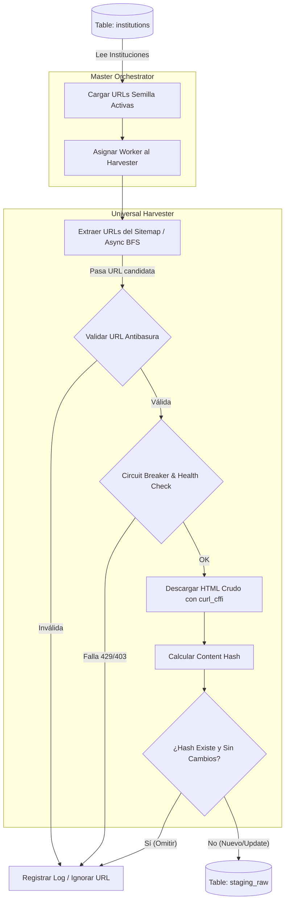

# Documento Detallado: Massive Harvesting (FG2 - Fase 1)

## 1. Visión Funcional y Objetivo de Negocio
El objetivo principal de la fase **Massive Harvesting (FG2 - Fase 1)** es actuar como el motor de descubrimiento de contenido primario del sistema. Su misión es rastrear sistemáticamente las URLs \"semilla\" (instituciones registradas) y extraer el HTML crudo de cada programa educativo sin aplicar lógica de negocio pesada en esta etapa.

Desde la perspectiva de negocio, esto garantiza que **Studiamatch** mantenga una cobertura exhaustiva, precisa y siempre actualizada de la oferta educativa del mercado. Almacenar esta materia prima es el primer paso crítico para el enriquecimiento posterior, permitiendo al sistema ofrecer comparativas precisas y confiables a los usuarios.

## 2. Puertas de Calidad (Quality Gates)
Para asegurar la resiliencia del sistema y mantener un consumo ético de los recursos ajenos, se imponen las siguientes puertas de calidad rigurosas antes de procesar y almacenar cualquier dato:

*   **Circuit Breaker (Protección de Origen)**: Si una institución comienza a devolver repetidos errores HTTP (ej. 429 Too Many Requests, 500+ Internal Error) o tiempos de respuesta anómalos, el circuito se abre y el *harvester* suspende temporalmente las peticiones a ese dominio para evitar baneos y sobrecargas.
*   **Validación Estricta de URLs (Filtro Antibasura)**: Antes de procesar cualquier enlace, este se valida contra patrones (Regex) y heurísticas para excluir automáticamente URLs irrelevantes (ej. `/login`, `/contacto`, `/blog`, documentos `.pdf` o imágenes).
*   **Deduplicación por Content-Hash**: Se genera un hash criptográfico (ej. SHA-256) del documento HTML extraído. Si el hash ya existe en la base de datos y coincide con el previo, se omite la actualización, optimizando drásticamente el uso de ancho de banda, almacenamiento y costos de procesamiento (LLM) en las siguientes fases.

## 3. El Rol del Orquestador en el Ciclo de Vida del Dato
El **Orquestador Maestro** (`master_orchestrator.py`) no es simplemente un script que invoca funciones, sino el guardián del ciclo de vida del dato. Sus responsabilidades incluyen:
*   **Gestión de Estado Centralizada**: Coordinar qué instituciones requieren rastreo basándose en frecuencias predefinidas (ej. cron semanal).
*   **Concurrencia y Politeness Controlado**: Administrar los hilos de ejecución de manera asíncrona pero restrictiva, asegurando que se respete el `robots.txt` y los unbrales máximos de peticiones por segundo por dominio.
*   **Telemetría y Registro de Auditoría**: Generar reportes sobre URLs fallidas, métricas operativas (latencia, tasa de éxito) y alertas críticas si una institución altera drásticamente su estructura web.
*   **Delegación de Transición**: Asegurar el pasaje limpio de la entidad \"Institución Semilla\" a \"Dato Crudo Almacenado\" (`staging_raw`), preparando el terreno para la Fase 1.5 (Saneamiento).

## 4. Detalle Técnico y Arquitectura

### 4.1. Arquitectura de Red (`curl_cffi` vs. Playwright)
La recolección a gran escala requiere un balance entre eficiencia computacional y evasión de bloqueos.
*   **Estrategia Principal (`curl_cffi`)**: Se reemplazó el tradicional `aiohttp` por `curl_cffi` como motor HTTP asíncrono primario. Esta librería permite realizar \"TLS Impersonation\", imitando la capa de red exacta de navegadores modernos, lo que ofrece un altísimo nivel de evasión consumiendo una fracción de los recursos (CPU/RAM) comparado con un navegador headless.
*   **Fallback (Playwright)**: Reservado exclusivamente para escenarios donde la carga asíncrona por JavaScript (SPAs sin SSR) hace imposible la extracción del DOM mediante solicitudes HTTP estáticas.

### 4.2. Lógica de Sigilo y Resiliencia (Stealth Operations)
Para evitar el disparo de firewalls avanzados (como Cloudflare o Akamai), el Harvester (`universal_harvester.py`) implementa un conjunto de heurísticas de mitigación:
*   **JA3/JA4 Fingerprinting**: Al usar `curl_cffi`, se mimetiza la huella criptográfica (TLS Client Hello) de navegadores reales (Chrome/Edge/Safari), logrando pasar las validaciones de capa de transporte que bloquean a los scrapers estándar.
*   **Coherencia de Headers**: Rotación inteligente del `User-Agent`, garantizando que exista una sincronización estricta con las cabeceras `Sec-CH-UA` y la firma TLS suplantada.
*   **Jitter (Delays Adaptativos)**: Implementación de pausas aleatorias (2 a 5 segundos) entre cada petición para simular tráfico humano y dispersar el análisis de ráfagas (Burst Control).
*   **Circuit Breaker & Semáforos**: Control estricto de concurrencia mediante `asyncio.Semaphore(3)` por dominio para evitar saturar el servidor origen. Si se detectan 3 errores consecutivos de tipo HTTP 403 o 429, el circuito se abre y aborta la institución temporalmente para evitar baneos de IP.

### 4.3. Mecanismo de Descubrimiento
El Harvester no depende de un catálogo de enlaces estáticos, sino que \"descubre\" la arquitectura de la institución de manera autónoma:
*   **Sitemaps Recursivos**: Primer intento mediante el parseo de `robots.txt` y sitemaps XML, navegando incluso por índices de sitemaps anidados para extraer mapas topológicos de las carreras.
*   **Async BFS (Breadth-First Search) Crawling**: Como mecanismo de rescate o expansión, un algoritmo de búsqueda en anchura rastrea de forma asíncrona la página siguiendo patrones de enlaces internos, acotados por profundidad y pertenencia al dominio de la institución.

### 4.4. Persistencia y Checkpointing (Delta Scraping)
El núcleo de la optimización de costos en FG2 reside en procesar únicamente lo nuevo o lo que ha cambiado:
*   **Estado 'Discovered' inmediato**: Cada URL encontrada (por Sitemap o BFS) se inserta instantáneamente en la base de datos bajo el estado `discovered`. Esto actúa como un *checkpoint* inmediato que evita dobles rastreos si el proceso se interrumpe.
*   **Gestión por Chunks (Lotes Atómicos)**: La cola de peticiones HTTP se procesa en lotes que permiten reanudar sin impacto en caso de fallos de conexión.
*   **Delta Scraping via Content Hashing**: En cada ejecución se calcula el hash SHA256 del contenido (`raw_html`). Solo si el hash difiere del registrado en la base de datos se promueve la actualización. Adicionalmente, una rutina de precarga (`_load_existing_urls`) omite el descubrimiento de URLs que ya existen inalteradas en el backlog.

### 4.5. Estructura de Salida: Tabla `staging_raw`
La salida de este proceso alimenta de forma directa la tabla `staging_raw` (Estación 1), diseñada para almacenar el formato bruto de manera tolerante a fallos antes de su limpieza:
*   **Identidad**: `id` (UUID) e `institution_id` (Relación a la tabla maestra).
*   **Enrutamiento**: `url` (Clave de integridad referencial).
*   **Captura Cruda**: `raw_name`, `raw_description`, `raw_html` (Limitado a 50kb), `raw_json_ld`, `raw_og_tags`.
*   **Control de Estado**: `status` (`discovered`, `pending`, `processed`, `discarded`, `error`) y `content_hash`.
*   **Telemetría**: `metadata` (JSONB) y `last_harvested_at`.

## 5. Diagrama de Flujo de Control (Mermaid)

## 6. Definición de Éxito de la Fase (DoD)
La fase **Massive Harvesting** se marca como completada y habilita el paso a la Fase 1.5 (Saneamiento) cuando cumple con lo siguiente:
1.  **Tasa de Extracción**: >95% de las URLs válidas rastreadas terminan en una respuesta HTTP exitosa y la captura de su HTML.
2.  **Tolerancia a Fallos Probada**: Cero caídas globales del proceso; las fallas de red de instituciones aisladas fueron mitigadas localmente por el *Circuit Breaker*.
3.  **Integridad Persistida**: Todos los registros exitosos están persistidos en la tabla `staging_raw`, incluyendo su `content_hash` y metadatos operativos (HTTP status, timestamp).
4.  **Consumo Ético**: No hubo incidentes de bloqueo de IP por parte de las instituciones objetivo; el rastreo fue indetectable como una amenaza (Stealth/Polite Harvesting).