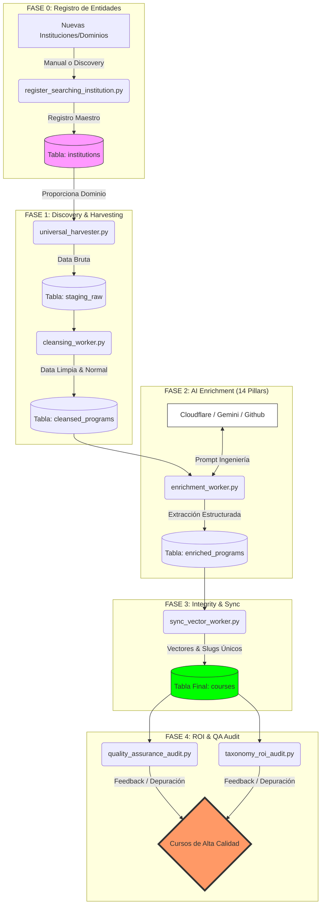

# 🚀 StudIAMatch: Golden Data Pipeline Documentation

Este documento detalla la arquitectura del motor de datos que alimenta a **StudIAMatch**, explicando la evolución desde un sistema artesanal hasta un flujo ETL (Extract, Transform, Load) de grado industrial.

---

## 🏗️ Arquitectura del Pipeline: Las 4 Estaciones
El flujo de datos se divide en 4 estaciones desacopladas para garantizar la máxima calidad y escalabilidad.

---

## 📊 Comparativa de Evolución (Core Flow)

| Fase | Legacy Workflow (Antiguo) | Golden Pipeline v2 (Actual) |
| :--- | :--- | :--- |
| **Arquitectura** | Monolítica y frágil. | **Desacoplada en 5 Etapas (0-4)**. |
| **Descubrimiento** | Scraping superficial por URL. | **Universal Harvester v2** (Sitemaps + BFS). |
| **Limpieza** | Manual o filtros básicos. | **Radar Anti-Noticias** y Deduplicación Multi-sede. |
| **Enriquecimiento** | Data plana (Nombre/URL). | **14 Pilares de Metadata** con IA real. |
| **Integridad** | Chocaba con Slugs duplicados. | **Slugs Únicos** basados en Sede e ID. |
| **Seguridad de Calidad** | Sin auditoría post-publicación. | **ROI & QA Audit** (Fase 4) para purga automática. |
| **Sincronización** | Directa a producción. | **Staging Progresivo** con auditoría. |

---

## 💎 Los 14 Pilares de Alta Fidelidad
Cada programa que alcanza la tabla `courses` ha sido enriquecido con los siguientes campos obligatorios extraídos por IA:

1.  **Nombre Oficial** (Sin encabezados basura).
2.  **Institución** (Mapeada al registro maestro).
3.  **Precio Estimado** (Normalizado a PEN).
4.  **Moneda**.
5.  **Duración** (En texto y meses).
6.  **Modalidad** (Presencial, Remoto o Híbrido).
7.  **Sede / Localidad** (Crítico para deduplicación).
8.  **Grado Académico** (Bachiller, Maestría, Curso, etc.).
9.  **Requisitos de Ingreso**.
10. **Malla Curricular** (Resumen estructurado en JSON).
11. **Fecha de Inicio** (Si está disponible).
12. **Categoría Taxonómica** (Tecnología, Negocios, etc.).
13. **Nivel de Dificultad** (Jr, Mid, Sr).
14. **Resumen de IA** (Descripción profesional de 2 frases).

---

## 🛠️ Scripts y Roles del Pipeline

### 1. `universal_harvester.py`
- **Ubicación:** `/scripts/core/`
- **Misión:** Mapear el 100% de la arquitectura web de la institución. Usa sitemaps y navegación recursiva.
- **Salida:** HTML bruto en `staging_raw`.

### 2. `cleansing_worker.py`
- **Ubicación:** `/scripts/core/`
- **Misión:** Control de calidad. Filtra blogs, noticias y páginas de 404. Normaliza el nombre y detecta la sede.
- **Salida:** Registros limpios en `cleansed_programs`.

### 3. `enrichment_worker.py`
- **Ubicación:** `/scripts/core/`
- **Misión:** Motor de Inteligencia. Ejecuta prompts expertos para extraer los 14 pilares.
- **Salida:** JSON estructurado en `enriched_programs`.

### 4. `sync_vector_worker.py`
- **Ubicación:** `/scripts/core/`
- **Misión:** Distribución final. Crea el slug único seguro y genera los embeddings (vectores) para búsqueda semántica.
- **Salida:** Registro activo en la tabla `courses`.

### 5. `quality_assurance_audit.py` (NUEVO - Fase 4)
- **Misión:** Escanea la tabla `courses` buscando campos vacíos, inconsistencias o datos "Mock". Detecta si la calidad ha bajado de un umbral aceptable.

### 6. `taxonomy_roi_audit.py` (NUEVO - Fase 4)
- **Misión:** Audita la categorización taxonómica. Asegura que el Retorno de Inversión (ROI) del dato sea alto, eliminando cursos genéricos que no aportan valor al usuario final.

---

## 🚀 Guía de Ejecución
Para disparar el pipeline completo para una nueva institución:

1. Registrar la institución en la tabla `institutions`.
2. Ejecutar el orquestador: `python scripts/core/master_orchestrator.py`.
3. Validar en la web de desarrollo.
