# Global SDLC Workflow - StudIAMatch (Detailed)

This document visualizes the complete engineering workflow and data lifecycle of **StudIAMatch**, orchestrated by **@sdlc-chief** and architected by **@architect-hexagonal**.

## Technical Workflow Diagram

```mermaid
flowchart TD
    %% Global Orchestration
    Start([Iniciativa / Tarea]) --> Health["@health-monitor"]
    
    subgraph Planning ["Fase 1: Planificación (Estrategia)"]
        direction TB
        Planner["@planner"] --> PlanDoc[/IMPLEMENTATION_PLAN.md/]
        PlanDoc --> Research["@researcher"]
    end

    Planning --> Gate1{User Approval}
    
    subgraph Design ["Fase 2: Arquitectura Hexagonal"]
        direction TB
        subgraph HEX_Domain ["Dominio (Core)"]
            D1[Program Entity]
            D2[Institution Entity]
            D3[SalaryMatrix]
        end
        
        subgraph HEX_Ports ["Puertos (Interfaces)"]
            P1[ScraperPort]
            P2[EnrichmentPort]
            P3[PersistencePort]
        end
        
        subgraph HEX_Adapters ["Adaptadores (Drivers)"]
            A1["Playwright / BS4"]
            A2["GPT-4 / Gemini"]
            A3["Supabase / Vector"]
        end
        
        HEX_Domain --> HEX_Ports --> HEX_Adapters
    end

    Design --> Gate2{Tech Approval}

    %% Main Execution FG Tracks
    subgraph Execution ["Fase 3: Desarrollo y Ejecución (FGs)"]
        direction LR
        
        subgraph FG1 ["FG1: Mapeo (Mensual)"]
            direction TB
            FG1_Run["discovery_institutions.py"] --> FG1_Out[(Nuevas Inst)]
        end
        
        subgraph FG2 ["FG2: ETL Pipeline (Semanal)"]
            direction TB
            S1["Estación 1: staging_raw"] --> S2["Estación 2: cleansed"]
            S2 --> S3["Estación 3: enriched"]
            S3 --> S4["Estación 4: courses"]
            
            subgraph TDD_Loop ["Dev Loop"]
                direction TB
                T1[Test Fail] --> T2[Code] --> T3[Refactor] --> T1
            end
        end
        
        subgraph FG3 ["FG3: Integridad (Diario)"]
            direction TB
            FG3_Run["integrity_ping.py"] --> Gracia{Periodo de Gracia 3d}
            Gracia -- Activo --> ProdOK[Status 200]
            Gracia -- Fallido --> Trash[Status Inactivo]
        end
    end

    Gate1 --> Design
    Gate2 --> Execution

    subgraph QA_Sec ["Fase 4: Certificación y Calidad"]
        direction TB
        QA["@qa-engineer"] --> E2E[Playwright E2E]
        Sec["@security-auditor"] --> RLS[Validation RLS]
        
        E2E --> Q_Gate{Git Flow Gate}
    end

    Execution --> QA_Sec

    subgraph Closure ["Fase 5: Documentación y Cierre"]
        direction TB
        DocW["@doc-writer"] --> MD[Update MD/Codemaps]
        MD --> MainMerge[Merge to main / Supabase Pro]
        MainMerge --> Done([Production Live])
    end

    Q_Gate -- certificacion branch --> Closure

    %% Styling
    classDef domain fill:#e1f5fe,stroke:#01579b,stroke-width:2px;
    classDef ports fill:#f3e5f5,stroke:#7b1fa2,stroke-width:2px;
    classDef adapters fill:#fff3e0,stroke:#e65100,stroke-width:2px;
    classDef fg fill:#f1f8e9,stroke:#33691e,stroke-width:2px;
    
    class D1,D2,D3 domain;
    class P1,P2,P3 ports;
    class A1,A2,A3 adapters;
    class FG1,FG2,FG3 fg;
```

## Description of FGs (Global Phases)

### FG1: Mapeo Institucional (Monthly)
*   **Objective**: Discover new licensed universities (MINEDU).
*   **Agent**: Supported by `@researcher` and `@planner`.
*   **Trigger**: Once a month.

### FG2: Carga Masiva y Delta Scraping (Weekly)
*   **The 4 Stations**:
    1.  **staging_raw**: Massive harvesting (Sitemaps/BFS).
    2.  **cleansed**: Selective cleaning and de-duplication.
    3.  **enriched**: Meta-data extraction (14 Pillars) via AI.
    4.  **courses**: Final production sync and Vector DB injection.
*   **Trigger**: Every Sunday (Weekly Master Load).

### FG3: Integridad y Periodo de Gracia (Daily)
*   **Objective**: Dead link detection (404).
*   **Mechanism**: 3-day grace period before course inactivation.
*   **Trigger**: Daily at 05:00 UTC.

## Hexagonal Architecture Detail

### Domain (Core)
Contains logic and entities that are independent of any framework. Business rules for ROI calculation, salary matrix management, and taxonomy rules reside here.

### Ports (Interfaces)
Standardized abstractions for external services. If we switch from Supabase to another provider, the Domain remains unchanged because it only talks to the `PersistencePort`.

### Adapters (Infrastructure)
Specific implementations for the environment.
*   **Input Adapters**: `discovery_institutions.py`, `manual_overrides`.
*   **Output Adapters**: `SupabaseAdapter`, `OpenAIAdapter`, `PlaywrightAdapter`.

---
*Created by Antigravity - Powered by @sdlc-chief & @architect-hexagonal*
